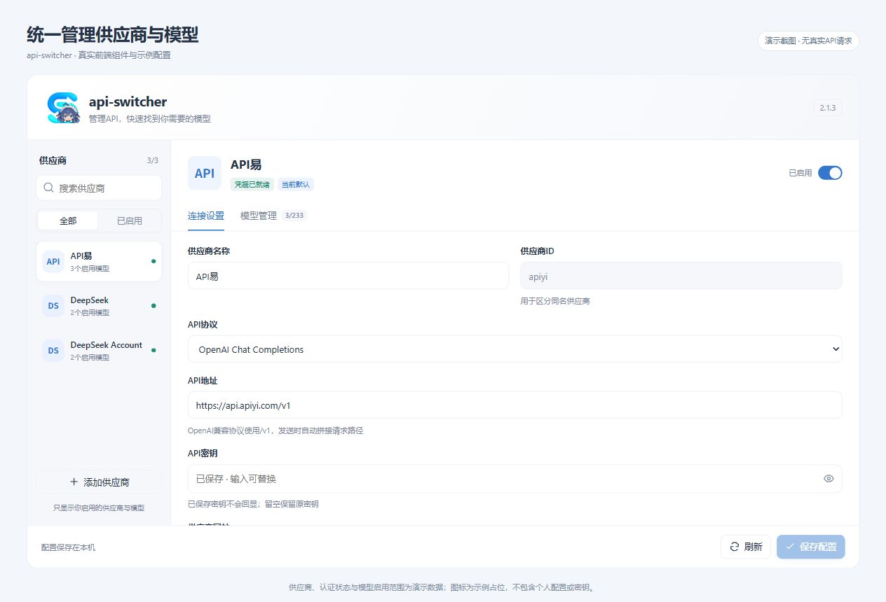
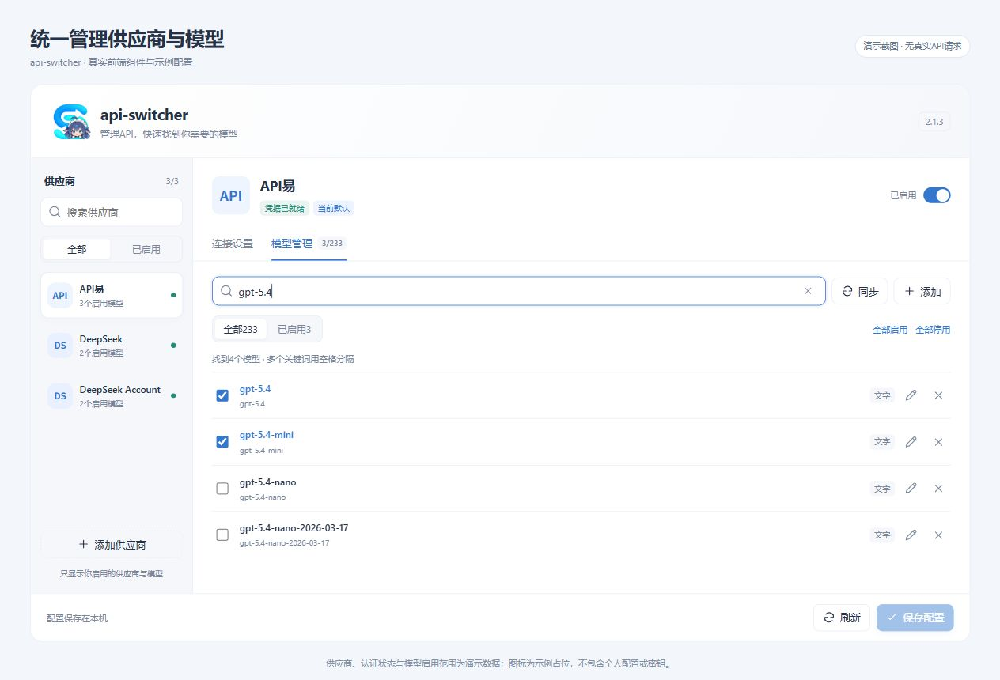
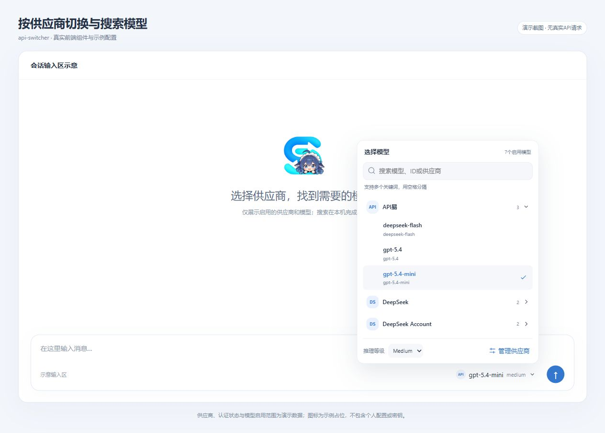
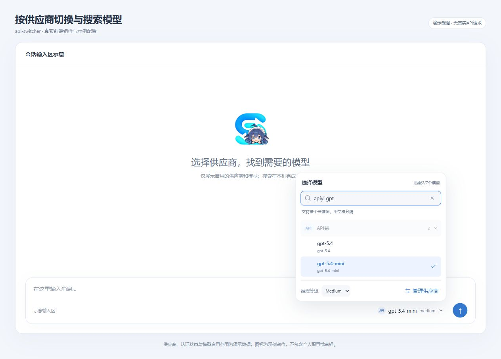

# api-switcher

<p align="center"></p>

**在一个设置页管理API供应商，在发送按钮旁选择模型。** api-switcher把供应商配置、模型启用和搜索整合进DSH的原生模型切换位置，适合同时使用官方API、兼容接口、聚合供应商和DSH原生账号。

当前版本：**2.1.4**。本版修复MiMo模型未选择推理等级时无法保存、供应商logo获取和图片logo底色，新增小米MiMo配置模板。内部包名保持`dsh-api-switcher`，升级保留已有配置。

[下载本版](https://github.com/ccl4-56-23-5/DSH-Plugins/releases/tag/api-switcher-v2.1.4) · [使用指南](2.1.4/docs/USER_GUIDE.md) · [安装说明](2.1.4/docs/INSTALLATION.md) · [更新记录](2.1.4/CHANGELOG.md)

## 可以做什么

| 功能 | 使用方式与结果 |
| --- | --- |
| 管理多个API来源 | 编辑供应商名称、API地址、协议、Key、网站和图标；区分同名但不同ID的来源 |
| 按需启用供应商 | 关闭暂时不用的供应商，配置仍保留，模型菜单只展示启用范围 |
| 按需启用模型 | 从供应商目录勾选部分模型，避免把完整目录塞进会话菜单；支持手动添加和编辑 |
| 按供应商分组切换 | 点击发送按钮旁的模型名称，展开或收起供应商分组，直接选择模型 |
| 两处模型搜索 | 设置页搜索完整目录；会话菜单搜索已启用模型，支持模型名称/ID、供应商名称/ID和多关键词 |
| 接入不同协议 | OpenAI Chat Completions、OpenAI Responses、Anthropic Messages |
| API易预配置 | 预填地址、协议、网站与公开文本模型目录，首次安装由用户补Key并启用 |
| 自动网站图标 | 保存供应商后获取网站图标，失败时使用名称图标，支持重新获取 |
| 键盘操作 | 菜单内上下键进入结果，回车选择，Esc关闭，支持一键清空搜索 |

会话中选择模型会更新当前会话的下一次请求，并保存新会话默认值；不会改写已开始的请求。模型参数及推理等级来自配置和宿主支持范围，详见使用指南。

## 界面与操作

以下4张沿用2.1.3的**演示截图**：使用当时真实前端组件与样式、隔离的示例供应商配置。2.1.4新增MiMo模板并修复透明logo。供应商认证状态、模型勾选和图标均为演示数据；API/DS字母图标为占位图。会话截图周围的输入区是示意容器，截图不代表真实DSH桌面或付费模型响应已通过验收。截图中没有用户Key、聊天记录或个人配置。

### 1. 统一配置供应商

选择左侧供应商，在“连接设置”编辑协议、API地址和密钥。右上角控制该供应商是否出现在模型菜单；继续向下滚动可设置网站、图标并执行连接测试。修改后点击“保存配置”。



### 2. 只启用需要的模型

“模型管理”可以搜索完整目录、勾选部分模型、同步目录或手动添加。图中搜索`gpt-5.4`找到4个模型，勾选了其中2个；供应商总计启用3/233个模型。未勾选的模型不会进入会话菜单。



### 3. 在发送按钮旁按供应商切换

模型菜单统一放在蓝色发送按钮旁。图中API易展开，DeepSeek和DeepSeek Account收起，供应商旁的数字表示已启用模型数量；底部“管理供应商”进入设置页。



### 4. 用供应商和模型关键词一起搜索

输入`apiyi gpt`，从7个启用模型中筛出API易的2个GPT模型。搜索支持多个关键词、大小写和全角归一化，以及常见ID分隔符兼容；清空后恢复搜索前的分组状态。



截图顺序由[screenshots.json](2.1.4/screenshots.json)声明；[截图说明与来源](2.1.4/docs/screenshots/README.md)记录组件、数据范围和文件哈希。

## 快速安装

1. 在本版Release下载`dsh-api-switcher-2.1.4-Windows.zip`并解压。
2. 结束DSH中正在运行的任务，双击`安装.cmd`。
3. 安装器校验SHA-256，备份配置，离线安装插件并重启DSH。
4. 点击发送按钮旁的模型名称，选择“管理供应商”；也可进入“插件管理→api-switcher→设置”。

默认支持DSH安装目录`D:\DeepSeekHarness`、用户配置目录`%USERPROFILE%\.dsh`和`desktop`profile。其他位置、TGZ导入、升级、卸载与回滚见[安装说明](2.1.4/docs/INSTALLATION.md)。

安装包包含全部运行文件，插件无额外npm运行依赖；DSH提供Node、pnpm、前端插槽、模型与凭据服务。Release提供Windows安装ZIP、预构建TGZ、独立源码ZIP、发行manifest和SHA-256清单。

## 配置API易

在设置左侧选择“API易”，核对字段，填写自己的Key，勾选需要的模型，开启供应商并保存。

| 字段 | 默认值 |
| --- | --- |
| 来源ID | `apiyi` |
| API地址 | `https://api.apiyi.com/v1` |
| 协议 | OpenAI Chat Completions |
| 网站 | `https://api.apiyi.com` |
| Key | 首次安装留空，由用户填写 |

首次预配置供应商停用，预选`gpt-5.4-mini`；升级保留用户已经保存的开关、模型选择与Key。随包目录为2026-10-09核对的233个Chat Completions文本模型，实际账户权限以供应商返回结果为准。详见[API易配置](2.1.4/docs/APIYI.md)与[API易官方快速开始](https://docs.apiyi.com/getting-started)。

## 哪些操作会访问网络

| 操作 | 网络与计费行为 |
| --- | --- |
| 搜索、勾选、保存连接配置、切换模型 | 不发送模型对话；保存后可能获取网站图标 |
| 获取图标 | 请求供应商网站图标，不向图标来源发送API Key |
| 同步模型 | 请求供应商模型目录，按需要使用Key，不发送对话 |
| 测试连接 | 经界面确认后发送真实模型请求，可能计费 |
| 在DSH中发送消息 | 由DSH向选中的供应商和模型发送，按该来源规则计费 |

本次修复未发送真实模型对话，MiMo密钥由用户后续填写。2.1.4完成情况与实际桌面验证边界见[验证记录](2.1.4/docs/VALIDATION.md)。

## 完整文档

| 文档 | 内容 |
| --- | --- |
| [使用指南](2.1.4/docs/USER_GUIDE.md) | 图文入口、供应商、模型、搜索、默认选择、连接测试 |
| [安装说明](2.1.4/docs/INSTALLATION.md) | 安装、升级、自定义路径、卸载、回滚 |
| [API易配置](2.1.4/docs/APIYI.md) | 地址、协议、目录同步与常见问题 |
| [架构与接口](2.1.4/docs/ARCHITECTURE.md) | 模块职责、DSH服务、HTTP契约与数据 |
| [开发与发布](2.1.4/docs/DEVELOPMENT.md) | 测试、构建、截图预览、校验、GitHub结构 |
| [故障排查](2.1.4/docs/TROUBLESHOOTING.md) | 界面、认证、目录、冲突、安装问题 |
| [验证记录](2.1.4/docs/VALIDATION.md) | 自动测试、打包与真实桌面验证的范围 |
| [截图说明](2.1.4/docs/screenshots/README.md) | 示例数据、组件来源、截图顺序与哈希 |
| [品牌资产](2.1.4/docs/BRANDING.md) | 透明logo、尺寸、生成记录与来源 |
| [安全说明](2.1.4/SECURITY.md) | 凭据、网络边界与问题报告 |
| [贡献指南](2.1.4/CONTRIBUTING.md) | 改动范围、验证与提交要求 |
| [第三方声明](2.1.4/THIRD_PARTY_NOTICES.md) | 测试快照与品牌素材来源 |

## 开发

要求Node.js20或以上。测试和构建不需要安装额外依赖：

```sh
node scripts/run-tests.mjs
node scripts/check-project.mjs
node scripts/build-release.mjs
```

构建输出在当前源码的`dist/`目录。Windows运行`Build-Release.ps1`生成一键安装ZIP；开发文档说明参数与解包校验。

## 许可

项目代码与原创文档采用[MIT](2.1.4/LICENSE)。第三方测试快照保留原许可；供应商商标与用户提供的角色形象来源见[第三方声明](2.1.4/THIRD_PARTY_NOTICES.md)。本项目不隶属于DeepSeek或API易。

版本目录是独立可构建项目，安装包在对应的dist/内；仅保留最新版源码与安装包，历史变更通过Git提交追溯。
