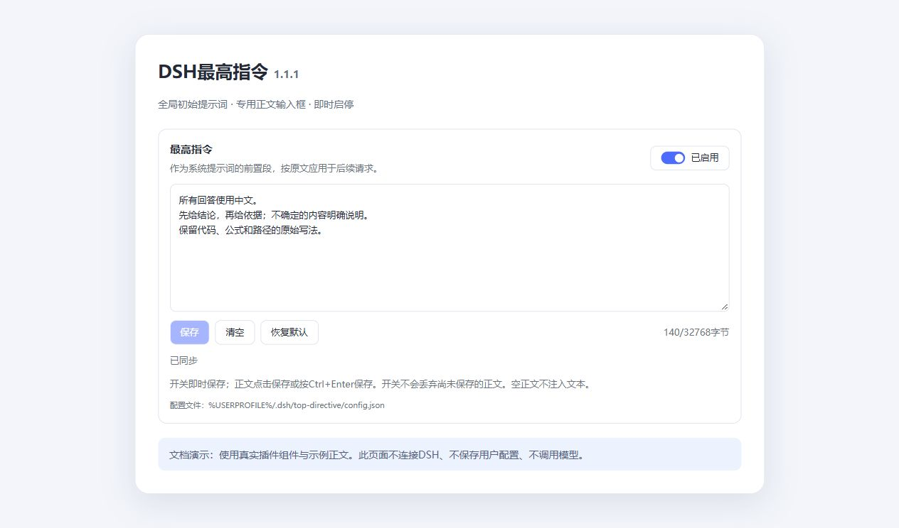

# 功能与使用

## DSH最高指令

在DSH插件页选择`dsh-top-directive`，进入“最高指令”面板。

| 操作 | 结果 |
|---|---|
| 编辑多行正文 | 可以输入中文、换行、标签和`{{变量}}`；正文不做变量插值 |
| 点击“保存”或按Ctrl+Enter | 保存原文；下一次模型请求采用新正文 |
| 切换“已启用/已停用” | 即时保存开关，保留尚未保存的正文草稿 |
| 清空正文并保存 | 停止注入自定义指令和对应边界段 |
| 点击“清空” | 清空正文并保存，当前开关状态保留 |
| 点击“恢复默认” | 保存空正文并启用开关 |

正文上限为32KiB，按UTF-8字节计算；超限拒绝保存。出现“保存失败”时先保留草稿，再检查磁盘权限或重新读取配置。其他窗口同时修改时，版本检查会拒绝覆盖。

保存后的正文进入模型API的system消息，在DSH身份段之前装配。此顺序用于全局初始提示词；模型API、DSH工具权限及模型提供方规则仍生效。已开始的请求使用其原有装配结果。

## 设置页演示

图中使用1.1.1真实React组件与隔离的示例正文；外围标题和背景为文档预览容器。该图没有连接DSH、保存用户配置或调用模型。实际桌面与模型验收见[验证记录](VALIDATION.md)。
